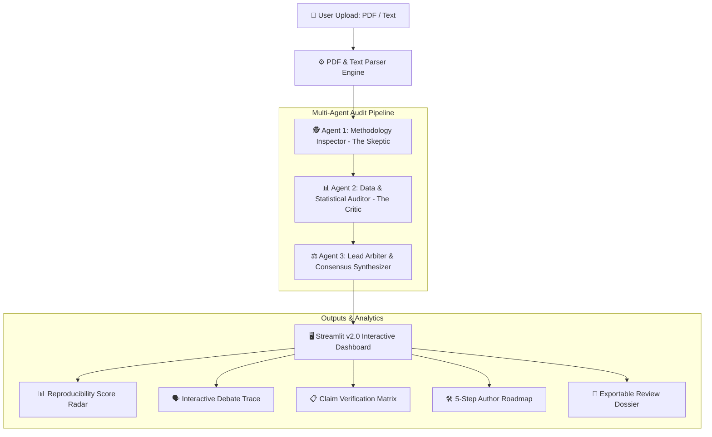

# MetaReviewer-AI 🔬
### Autonomous Scientific Peer-Review & Reproducibility Arbiter
**IIT Madras "Research Agents Hack" Submission (v2.0 Hackathon Edition)**

[](https://python.org)
[](https://streamlit.io)
[](https://github.com/langchain-ai/langgraph)
[](https://ai.google.dev)
[](LICENSE)

---

## 🎯 Problem Statement & Executive Summary

Modern scientific peer review faces critical bottlenecks: high submission volumes lead to superficial reviews, unverified statistical overclaims, unstated baseline assumptions, and irreproducible experimental pipelines. 

**MetaReviewer-AI** solves this by establishing a production-ready, multi-agent AI system powered by **LangGraph** and **Google Gemini**. By orchestrating specialized, collaborating LLM agents—a **Methodology Inspector (The Skeptic)**, a **Data & Statistical Auditor (The Critic)**, and a **Lead Arbiter (Consensus Synthesizer)**—MetaReviewer-AI evaluates papers adversarially, produces an objective **Reproducibility Score (0–100)**, builds a **Claim Verification Matrix**, and formulates a prioritized **5-Step Author Improvement Roadmap**.

---

## 🏗️ Multi-Agent Architecture



---

## 📸 Visual Dashboard & Live Review Walkthrough

<div align="center">
  <h3>⚡ Real-Time Reproducibility Audit & 5-Dimension Radar</h3>
  
</div>

<br/>

| 🔍 Multi-Agent Debate Trace | 📋 Claim Verification Grid |
| :---: | :---: |
|  |  |

| 🗺️ 5-Step Author Action Roadmap | 📄 One-Click Exportable Dossier |
| :---: | :---: |
|  |  |

---

## 🤖 Agent Roles & Evaluation Matrix

| Agent | Identity & Role | Target Inspection Domain | Key Output Deliverables |
|---|---|---|---|
| **Agent 1** | **Methodology Inspector** *(The Skeptic)* | Extracted hypotheses, core claims, experimental setup, unstated baseline assumptions, procedural ambiguities. | Methodological Rigor Score (0-100), Ambiguities List, Assumption Audit. |
| **Agent 2** | **Data & Statistical Auditor** *(The Critic)* | Sample sizes ($N$), p-values, confidence bounds, math formula consistency, empirical evidence matching, data leakage risks. | Statistical Integrity Score (0-100), Formula Check, Leakage Warnings. |
| **Agent 3** | **Lead Arbiter** *(Consensus Synthesizer)* | Cross-agent reconciliation, debate synthesis, final verdict, author improvement plan, overall score calculation. | **Reproducibility Score (0-100)**, Score Radar, Claim Matrix, 5-Step Roadmap, Review Dossier. |

---

## 🔥 MetaReviewer-AI v2.0 Upgraded Features

1. **Intelligent JSON & API Resilience Engine ([`utils/json_helper.py`](file:///C:/Users/WALTON/.gemini/antigravity/scratch/MetaReviewer-AI/utils/json_helper.py)):**
   - Automatically strips markdown blocks (` ```json ... ``` `), fixes trailing commas, and executes **heuristic regex fallback extraction** so score charts and matrices **never receive zero/null values**.
2. **🗣️ Interactive Multi-Agent Debate Trace:**
   - Visual step-by-step trace showing Agent 1 (Skeptic) raising methodological concerns, Agent 2 (Critic) identifying statistical anomalies, and Agent 3 (Arbiter) resolving conflicts into consensus.
3. **📋 Claim-by-Claim Verification Matrix:**
   - Badged verification breakdown of paper claims:
     - ✅ *Supported & Verifiable*
     - ⚠️ *Weak Evidence / Unstated Assumption*
     - ❌ *Methodologically Flawed / Inconclusive*
4. **🛠️ 5-Step Author Improvement Roadmap:**
   - Prioritized, camera-ready roadmap cards with target section, recommended technical actions, and expected impact.
5. **📄 One-Click Exportable Review Dossier:**
   - Instant export of full peer-review reports in Markdown (`.md`) or raw state (`.json`).

---

## 📂 Project Structure

```
MetaReviewer-AI/
├── agents/
│   ├── state.py                  # TypedDict ReviewState with Annotated[List[str], operator.add]
│   ├── methodology_agent.py      # Agent 1: Methodology & Claim Inspector
│   ├── statistical_agent.py      # Agent 2: Data & Statistical Auditor
│   └── arbiter_agent.py          # Agent 3: Lead Arbiter & Consensus Synthesizer
├── utils/
│   ├── pdf_parser.py             # PDF text extraction with layout preserving fallbacks
│   └── json_helper.py            # Robust JSON cleaner & heuristic regex fallback parser
├── docs/images/                  # UI Visual Walkthrough & Radar Screenshots
│   ├── dashboard_radar.png
│   ├── debate_trace.png
│   ├── claim_matrix.png
│   └── author_roadmap.png
├── sample_papers/
│   ├── flawed_paper.txt          # Test paper with statistical & sample size defects (N=15)
│   └── rigorous_paper.txt        # Test paper demonstrating high scientific rigor
├── workflow.py                   # LangGraph state graph orchestrator & compiler
├── app.py                        # Streamlit v2.0 Interactive Review Dashboard
├── requirements.txt              # Dependencies (langgraph, google-genai, streamlit, plotly)
├── .env.example                  # Environment key configuration template
├── LICENSE                       # MIT License (2026)
└── README.md                     # Hackathon submission documentation
```

---

## ⚡ Quickstart Installation & Reproducibility Guide

### 1. Prerequisites
- Python 3.10 or higher
- Google Gemini API Key ([Get API Key](https://aistudio.google.com/))

### 2. Setup Project Environment
```bash
# Clone the repository
git clone https://github.com/fokrulanthro16-eng/MetaReviewer-AI.git
cd MetaReviewer-AI

# Create virtual environment (optional)
python -m venv venv
# Activate on Windows:
venv\Scripts\activate
# Activate on Linux/macOS:
source venv/bin/activate

# Install dependencies
pip install -r requirements.txt
```

### 3. Environment Configuration
Copy `.env.example` to `.env` and add your Google Gemini API key:
```bash
cp .env.example .env
```
Inside `.env`:
```env
GOOGLE_API_KEY=your_gemini_api_key_here
```
*(Note: You can also enter your API key directly in the Streamlit UI sidebar)*

### 4. Launch Application
Run the Streamlit dashboard:
```bash
streamlit run app.py
```
Open your browser at `http://localhost:8501`.

---

## 🧪 Instant 1-Click Testing with Sample Papers

1. Open the sidebar in Streamlit and select **Use Sample Papers**.
2. Select **`flawed_paper.txt`** to observe how the multi-agent graph catches small sample sizes ($N=15$), overclaimed p-values ($p < 0.0001$), and data leakage.
3. Select **`rigorous_paper.txt`** to test high-scoring reproducible evaluation.
4. Click **🚀 Launch Multi-Agent Audit**!

---

## 🏆 Hackathon Alignment (IIT Madras Research Agents Hack)

- **Theme:** Faster, Reproducible, and Verifiable Research.
- **Collaborating Multi-Agent Setup:** 3 specialized LLM agents coordinated via LangGraph `StateGraph` with `Annotated[List[str], operator.add]` state reducers.
- **Resilience:** Heuristic regex parsing ensures zero-failure execution even under API rate limits or formatting anomalies.
- **UI/UX Excellence:** Interactive Streamlit dashboard with 6 specialized tabs, Plotly score radar, claim matrices, debate traces, and downloadable review dossiers.

---
*Developed for the IIT Madras "Research Agents Hack". Released under the MIT License.*
